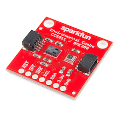
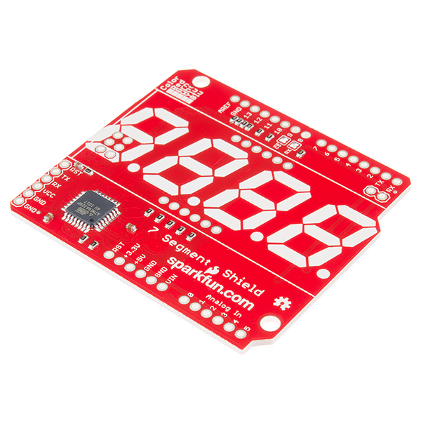
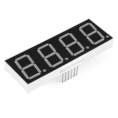
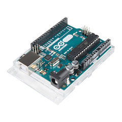

# EnvironmentMonitor
Environment Monitor for watching CO2, Temperature and Humidity.

## SparkFun Environmental Combo Breakout - CCS811/BME280

The [CCS811 and BME280 combination](https://www.sparkfun.com/products/14348) breakout board from [SparkFun](https://www.sparkfun.com/) provides all the meassurements needed for watching the indoor environemt. All made easy using Qwiic connectors and I2C communication.

The CCS811 provides readings for equivalent CO2 (or eCO2) in the parts per million (PPM) and total volatile organic compounds in the parts per billion (PPB). 

The CCS811 also has a feature that allows it to fine-tune its readings if it has access to the current humidity and temperature. Luckily, the BME280 provides humidity, temperature and barometric pressure!

## 7 Segment Display

This [SparkFun](https://www.sparkfun.com/)  [OpenSegment Shield](https://www.sparkfun.com/products/13190) was specifically designed to run on top of most Arduino Uno compatible boards, all you need to do is attach headers and your choice of 7-segment display to the shield and snap it in, no bread boards required. The OpenSegment Shield can combine a classic 4-digit 7-segment display and an ATMega328 microcontroller allowing you to control every segment individually using only a few serial lines.

The [OpenSegment Shield](https://www.sparkfun.com/products/13190) can be controlled in one of three ways: Serial TTL communication, SPI serial communication or I2C serial.

In combination with [7-Segment Display - 20mm (Blue)](https://www.sparkfun.com/products/11408) this will show the CO2, Temparature and Humidity measurements in cycles.

## Arduino Uno R3

Combine all of this on top of an [Arduino R3](https://www.sparkfun.com/products/11021) and you have a portable environment monitor :)